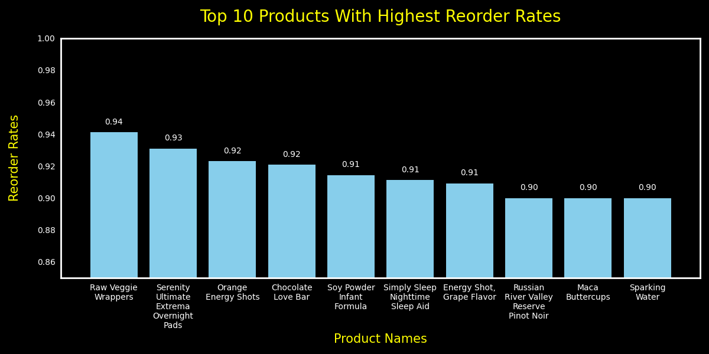
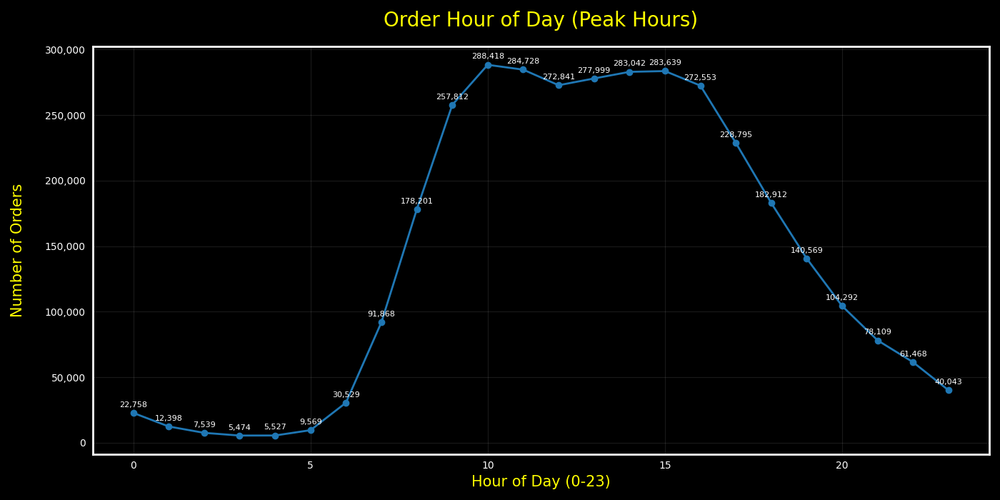
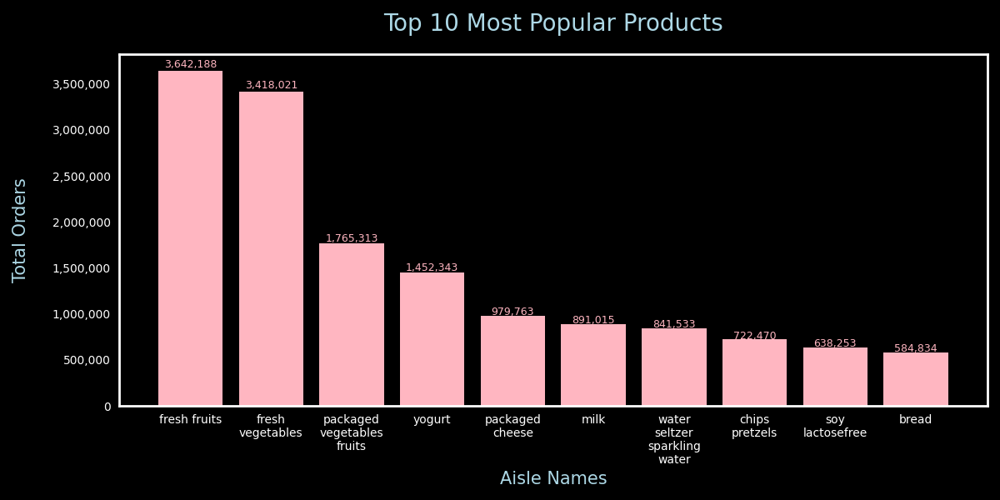

# Instacart Data Analysis (SQL + Python)

## 📌 Project Overview
This project is an analytical study of the **US-based Instacart online grocery platform** using SQL and Python.  
The goal is to analyze customer purchasing behavior, product demand, reorder patterns, peak shopping hours, and customer loyalty to extract insights that could support real-world business decisions.

The analysis simulates how data analysts and product teams explore large-scale e-commerce data to improve inventory planning, promotions, and customer engagement.

Check out the SQL queries here: [SQL Queries](project_sql/) along with them being listed down in this readme file.


---

## 🎯 Objectives
The main objectives of this project are to:
- Identify products with the **highest reorder rates**
- Analyze **orders per customer and product distribution**
- Determine **peak ordering hours**
- Understand **product and category popularity**
- Study **customer loyalty and repeat purchasing behavior**
- Perform a **final customer-level behavioral analysis**

---

## 📊 Dataset
- **Source:** Instacart Online Grocery Shopping Dataset (Kaggle)
- **Region:** United States
- **Type:** Relational transactional dataset

### Key Tables Used
- `orders`
- `order_products_prior`
- `products`
- `aisles`

Additional tables were used where necessary to support joins and more specialized analytical queries.

---

## 🧰 Tech Stack
### Languages & Tools
- **SQL**
- **Python**

### Python Libraries
- `pandas`
- `matplotlib`
- `sqlalchemy`
- `textwrap`

---

## 🔍 Project Workflow

1. Database exploration using SQL
2. Writing analytical SQL queries with joins, CTEs, and window functions
3. Exporting query results for visualization
4. Creating charts in Python
5. Interpreting results for business insights

---

## 🧠 SQL Analysis & Queries

---

## Query 1: Highest Reorder Rate Products

### Purpose
This query calculates the average reorder rate for products to identify items that customers repeatedly purchase.
Products with high reorder rates indicate strong recurring demand and customer reliance.

### SQL Query
```sql
SELECT
    p.product_name,
    AVG(o.reordered::FLOAT) AS reorder_rate
FROM order_products_prior o
INNER JOIN products p ON o.product_id = p.product_id
GROUP BY
    p.product_name
ORDER BY
    reorder_rate DESC
LIMIT 10;
```
### Visualization


---

## Query 2: Product Distribution by Aisle
### Purpose

This query analyzes the distribution of products across aisles by counting distinct products in each aisle.
It helps understand which aisles offer the widest product variety.

### SQL Query
``` sql
SELECT
    a.aisle_name,
    COUNT(DISTINCT p.product_id) AS prod_count
FROM products p
INNER JOIN aisles a ON p.aisle_id = a.aisle_id
WHERE
    aisle_name != 'missing'
GROUP BY 
    a.aisle_name
ORDER BY
    prod_count DESC
LIMIT 10;
```
---

## Query 3: Peak Ordering Hours
### Purpose

This query identifies the hours of the day when customers place the most orders.
Understanding peak hours can help optimize logistics, staffing, and promotional timing.

### SQL Query
```sql 
SELECT
    order_hour_of_day,
    COUNT(order_id) AS order_count
FROM orders
GROUP BY
    order_hour_of_day
ORDER BY
    order_count DESC;
```
### Visualization

---


---

## Query 4: Product Popularity by Aisle
### Purpose

This query measures product popularity by counting the total number of orders for products in each aisle.
It highlights the most in-demand product categories.

### SQL Query
```sql
SELECT
    a.aisle_name,
    COUNT(op.product_id) AS total_orders
FROM order_products_prior op
INNER JOIN products p ON p.product_id = op.product_id
INNER JOIN aisles a ON p.aisle_id = a.aisle_id
GROUP BY 
    a.aisle_name
ORDER BY
    total_orders DESC
LIMIT 10;
```
---

### Visualization



---

## Query 5: Customer Loyalty Analysis
### Purpose

This query evaluates customer loyalty by calculating individual reorder percentages and identifying each customer’s most frequently ordered product.
It helps distinguish highly loyal customers and understand repeat purchasing behavior.

### SQL Query
```sql
WITH reorder_stats AS (
  SELECT
    o.user_id,
    SUM(CASE WHEN op.reordered = 1 THEN 1 ELSE 0 END) * 1.0 / COUNT(op.product_id) AS reorder_rate_raw,
    COUNT(op.product_id) AS total_items_ordered
  FROM orders o
  JOIN order_products_prior op ON o.order_id = op.order_id
  GROUP BY o.user_id
),
top_products AS (
  SELECT user_id, product_id, prod_count
  FROM (
    SELECT
      o.user_id,
      op.product_id,
      COUNT(*) AS prod_count,
      ROW_NUMBER() OVER (PARTITION BY o.user_id ORDER BY COUNT(*) DESC) AS rn
    FROM orders o
    JOIN order_products_prior op ON o.order_id = op.order_id
    GROUP BY o.user_id, op.product_id
  ) ranked
  WHERE rn = 1
)
SELECT
  rs.user_id,
  ROUND(100.0 * rs.reorder_rate_raw, 2) AS reorder_percentage,
  rs.total_items_ordered,
  tp.product_id AS most_ordered_product_id,
  p.product_name,
  tp.prod_count AS times_user_ordered_that_product
FROM reorder_stats rs
JOIN top_products tp ON rs.user_id = tp.user_id
LEFT JOIN products p ON tp.product_id = p.product_id
ORDER BY rs.reorder_rate_raw DESC, tp.prod_count DESC
LIMIT 100;
```
---

## Query 6: Final Customer Analysis
### Purpose

This final query performs a comprehensive customer-level analysis by combining preferred order times, reorder percentages, most ordered products, and aisle information.
It provides a holistic view of customer purchasing behavior.

### SQL Query
```sql
WITH ranked_orders AS (
SELECT
    user_id,
    order_hour_of_day,
    COUNT(order_id) AS order_count,
    ROW_NUMBER() OVER (PARTITION BY user_id ORDER BY COUNT(order_id) DESC) AS rn
FROM orders 
GROUP BY
    user_id,
    order_hour_of_day
),
top_products AS (
    SELECT
    o.user_id,
    op.product_id,
    ROUND(
        100.0 * SUM(
            CASE
                WHEN reordered=1 THEN 1
                ELSE 0
                END
        ) / COUNT(op.product_id), 2
    ) AS reorder_percentage
FROM orders o
INNER JOIN order_products_prior op ON o.order_id=op.order_id
GROUP BY
    o.user_id,
    op.product_id
),
product_info AS (
    SELECT
    p.product_id,
    p.product_name,
    a.aisle_name
FROM
    products p
    INNER JOIN aisles a ON p.aisle_id=a.aisle_id
)
SELECT
    ro.user_id,
    ro.order_hour_of_day AS top_order_hour,
    tp.product_id,
    pi.product_name,
    pi.aisle_name,
    tp.reorder_percentage,
    ro.order_count
FROM
    ranked_orders ro 
    INNER JOIN top_products tp ON ro.user_id=tp.user_id
    INNER JOIN product_info pi ON tp.product_id=pi.product_id
WHERE
    ro.rn=1
ORDER BY
    tp.reorder_percentage DESC, 
    ro.order_count DESC
LIMIT 25;
```

---

## 📌 Key Insights

- Raw veggie wrappers, Serenity overnight pads, and orange energy shots have the highest reorder rates

- **Peak ordering time** occurs around **10 AM**, with nearly **300,000 orders**

- **Fresh fruits** lead product popularity with approximately **3.6 million** purchases, followed by fresh vegetables at **3.4 million**

- A small set of products drives a significant portion of repeat purchases

---

## 📁 Folder Structure
```
Assets/          # Graph images
data_load/       # Table creation scripts
project_sql/     # Final SQL queries
test queries/    # Exploratory SQL analysis
README.md
```

---

## 🚀 Difficulty Level

### Beginner → Intermediate

This project involves complex SQL logic, window functions, and Python-based visualization, making it suitable as a strong portfolio project.

---

### 🔮 Possible Future Improvements

- Customer segmentation and cohort analysis

- Market basket analysis

- Predictive modeling for reorder behavior

- Dashboard creation using Power BI or Tableau
---

## 📎 Conclusion

This project demonstrates how SQL and Python can be combined to analyze large-scale e-commerce data and extract actionable insights.
It reflects practical analytical thinking and real-world data workflows.

**Author**: Abdullah

**Project Type**: Portfolio / Learning Project
